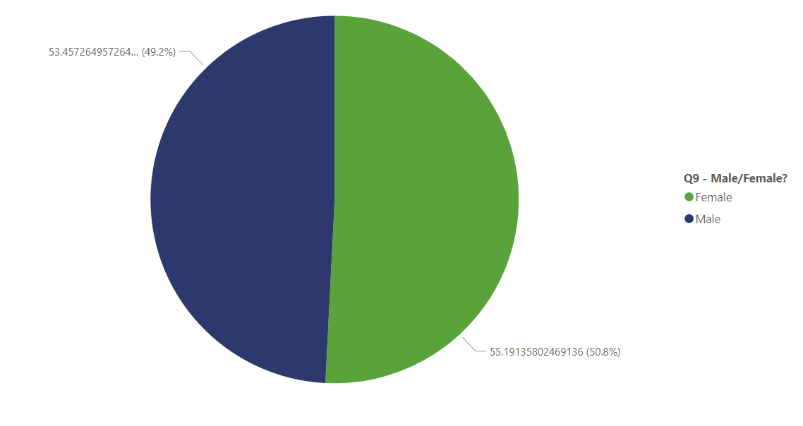

# Data-Professional-Survey

## Project Description

The goal of this project is to analyze the career progression of individuals in the data field, focusing on factors that influence job satisfaction and salary.

## Data Description
The Data Professional Survey.xlsx file in the data directory contains the dataset used in this
project.
Columns:
1-Which Title Best Fits your Current Role.
2-Did you switch careers into Data.
3-Current Yearly Salary (in USD)?
4-What Industry do you work in?
5-Favorite Programming Language.
6-How Happy are you in your Current Position with the following? (Salary)
7-How Happy are you in your Current Position with the following? (Work/Life Balance)
8-How Happy are you in your Current Position with the following? (Management)
9-How difficult was it for you to break into Data?
10-Male/Female?
11- Which Country do you live in?
12-Current Age.
## Data Cleaning Steps:
-Identify Missing Values by Apply filters to my data to quickly find cells that are empty or have specific error values like N/A then remove them.
-Check Data Types and Formatting
- Check spelliing mistakes and inconsistencies
- remove Duplicates Valus in Company Column by Useing conditional formatting to highlight cells that are duplicated
## Exploratory Data Analysis (EDA) Steps:
-Descriptive Statistics:
Calculate Average  age of Survey takers.
Calculate Count of Survey takers.
Calculate Average Salary in thousands by job titlte
Calculate How Happy are you in your Current Position ? (Salary/Woek-life Balance)
Calculate Favorite Programming Language
Calculate How difficult was it for you to break into Data?

## Visualizations:
-Calculate Count of Survey takers: 

 

-Calculate Average  age of Survey takers.

 

-Bar charts to compare Average Salary in thousands by job titlte:

                   

-Pie charts to compare Average Salary by sex:

-Pie charts to Calculate How difficult was it for you to break into Data?:

-Column charts to visualize favorite programming language for each data related title:

 
Pie charts to Show How happy are you with work-life balance and Salary:

## Conclusion

-The survey had 630 respondents, mostly from the USA, with an average age of 29.8 years.

-Data professionals rate their salary satisfaction at 4.7/10 and work-life balance at 5.74/10, indicating moderate contentment with room for improvement.

-Python is the preferred programming language, while Java is least favored.

-There’s a slight gender pay gap, with males earning 55% on average and females 53%.

-Entry into the data field is viewed as moderately challenging, with 24% finding it difficult, 21% easy, and 42% neutral.

